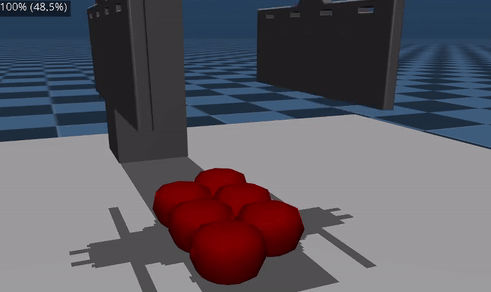
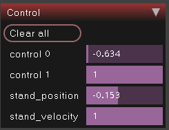
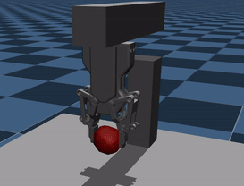

# Grasping Fruit Simulator

This project simulates the picking of vine tomatoes using an end effector. The simulation runs on the MuJoCo platform and simulates the soft body dynamics of the tomato against the end effector.

## Getting Started

MuJoCo needs do be downloaded and extracted. Open a terminal and change directory to the project folder and run the following command:

    make setup

Now that MuJoCo is downloaded and setup, The simulation can be ran using:

    make run

## Gripper control

The gripper can be controlled through four sliders found in the top right of the simulation panel, the top two control the gripper opening position, while the bottom two control the arm position.

## Single fruit example

